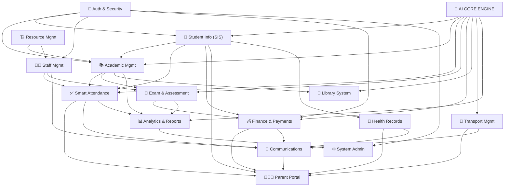
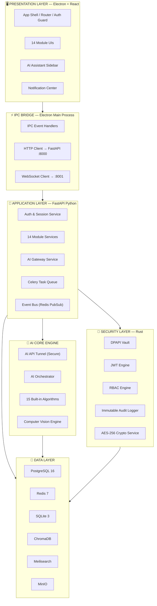
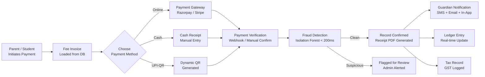
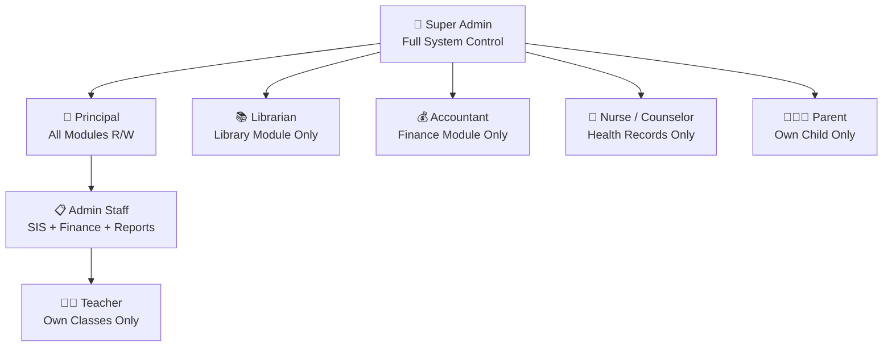
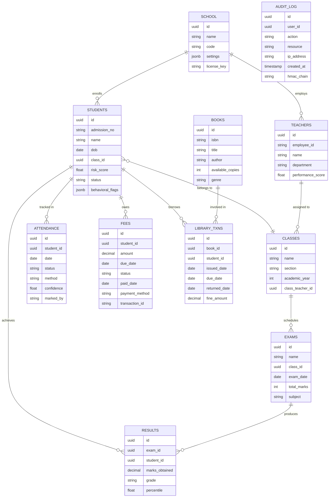
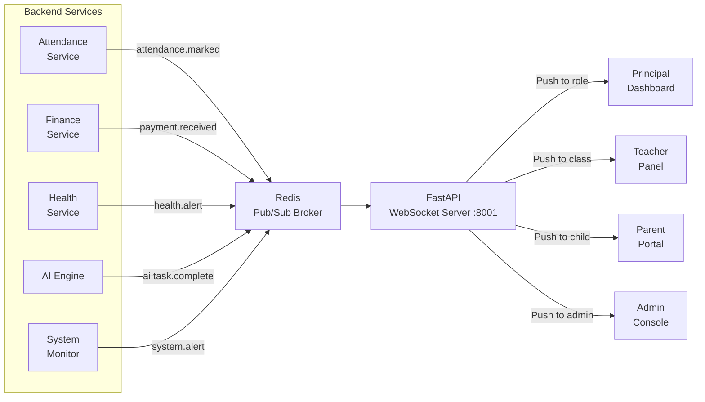
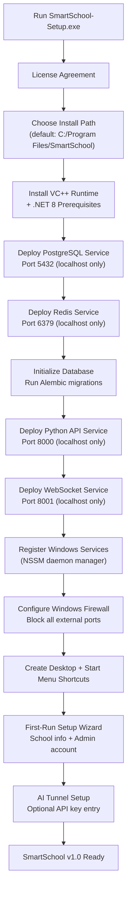
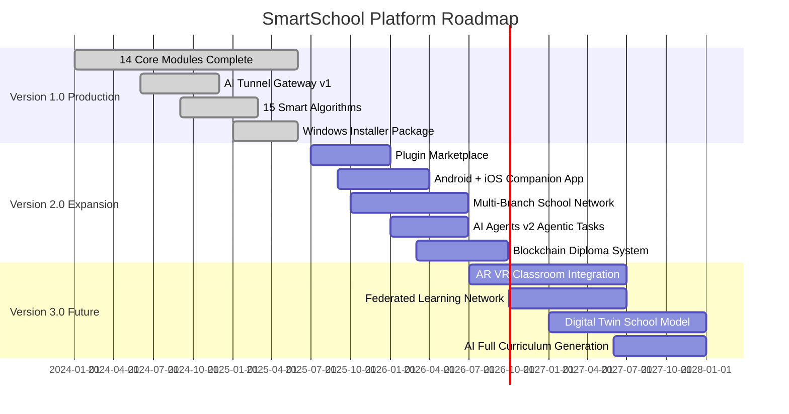
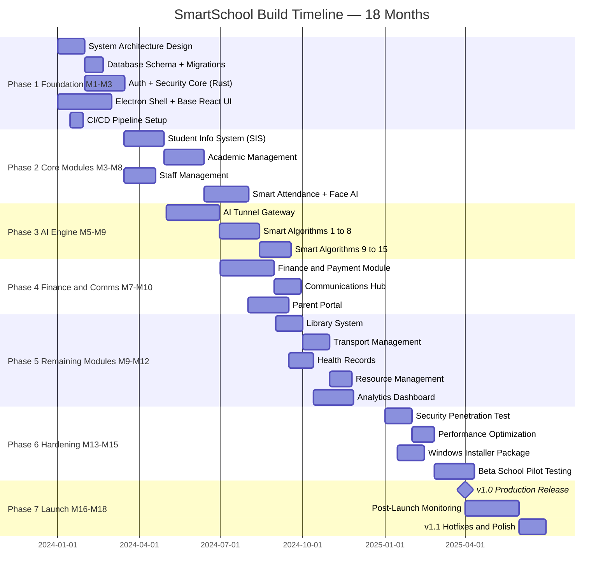

# 🏫 SMART SCHOOL DESKTOP SOFTWARE
## Complete Engineering Blueprint — Windows Native | AI-First | Enterprise-Grade

> **Blueprint Version:** 1.0.0  
> **Platform Target:** Windows 10 / 11 (x64) — Desktop Only  
> **Architecture:** AI-First Layered Microservices  
> **Security Model:** Zero-Trust | End-to-End Encrypted  
> **Classification:** Future-Proof Production Design Document

---

## 📋 TABLE OF CONTENTS

| # | Section | Summary |
|---|---------|---------|
| 01 | [Executive Summary](#01-executive-summary) | Vision, pillars, KPI targets |
| 02 | [Visual System Map](#02-visual-system-map) | Full topology, module map |
| 03 | [Technology Stack](#03-technology-stack) | Languages, frameworks, decision matrix |
| 04 | [System Architecture](#04-system-architecture) | Layers, IPC, service mesh |
| 05 | [Module Specifications](#05-module-specifications) | 14 complete module specs with features |
| 06 | [AI Core Engine & Tunnel](#06-ai-core-engine--tunnel) | API tunnel, orchestrator, providers |
| 07 | [Smart Algorithms Catalog](#07-smart-algorithms-catalog) | 15 built-in AI algorithms |
| 08 | [Security Architecture](#08-security-architecture) | Zero-trust, RBAC, encryption layers |
| 09 | [Database Design](#09-database-design) | Schema, ERD, partitioning strategy |
| 10 | [Payment Gateway Integration](#10-payment-gateway-integration) | Gateways, flows, invoicing |
| 11 | [Real-Time Communication Layer](#11-real-time-communication-layer) | WebSocket, events, alerts |
| 12 | [Windows-Specific Features](#12-windows-specific-features) | Native OS integration |
| 13 | [API Design Standards](#13-api-design-standards) | REST, versioning, auth flow |
| 14 | [Deployment & Installation](#14-deployment--installation) | Installer, services, requirements |
| 15 | [Future Roadmap](#15-future-roadmap) | v1 → v3 evolution plan |
| 16 | [Implementation Timeline](#16-implementation-timeline) | Phased Gantt breakdown |
| 17 | [Appendix](#17-appendix) | Ports, directories, benchmarks |

---

## 01. EXECUTIVE SUMMARY

**SmartSchool** is a next-generation, AI-powered Windows desktop platform engineered to serve as the **intelligent central nervous system** of modern educational institutions. It replaces fragmented manual workflows with autonomous AI regulation, integrates any Large Language Model through a proprietary secure API tunnel, and maintains enterprise-grade security throughout every layer — with zero-trust as the foundational principle.

### 🎯 Core Design Pillars

| Pillar | Definition | Mechanism |
|--------|-----------|-----------|
| 🧠 **AI-First Design** | Every module is AI-augmented; manual tasks auto-regulated | Embedded algorithms + AI Tunnel |
| 🔒 **Zero-Trust Security** | No implicit trust — verify everything, encrypt everything | RBAC + Multi-layer Encryption |
| ⚡ **High Performance** | Sub-100ms UI; async heavy processing | Rust core + Redis cache layer |
| 🔌 **AI Tunnel** | Any LLM via API key flows directly into every core module | Gateway → Orchestrator → Modules |
| 📦 **Modular Architecture** | Independently deployable, hot-swappable modules | Plugin-based design |
| 🖥️ **Windows-Native** | Deep Windows OS integration | Electron + WinRT + DPAPI |
| 📈 **Future-Proof** | Grows with educational tech trends | Versioned API + Plugin Store |
| 🏛️ **Data Sovereignty** | All data stays on-premises by default | Local DB + optional cloud sync |

### 🎯 Key Performance Targets

| Metric | Target |
|--------|--------|
| UI Response Time | < 100ms |
| AI Tunnel Response | < 3 seconds (streaming) |
| Database Query (uncached) | < 50ms |
| Database Query (cached) | < 5ms (Redis) |
| Facial Recognition Match | < 300ms per frame |
| System Uptime | 99.9% |
| Max Concurrent Users | 500+ per installation |
| Data Encryption Coverage | 100% sensitive fields |
| AI Task Automation Rate | 70%+ of routine tasks |
| Smart Algorithm Coverage | 15 built-in, no API key needed |

---

## 02. VISUAL SYSTEM MAP

### 🗺️ Complete System Topology

```
╔══════════════════════════════════════════════════════════════════════════════════════╗
║                   SMART SCHOOL DESKTOP — FULL SYSTEM TOPOLOGY                        ║
╠══════════════════════════════════════════════════════════════════════════════════════╣
║                                                                                      ║
║  ┌──────────────────────────────────────────────────────────────────────────────┐    ║
║  │                  PRESENTATION LAYER  (Electron v32 + React 18)               │    ║
║  │                                                                              │    ║
║  │  [Dashboard] [SIS] [Academic] [Staff] [Attendance] [Exams] [Finance]         │    ║
║  │  [Library] [Parent Portal] [Comms] [Transport] [Health] [Analytics] [Admin]  │    ║
║  └──────────────────────────┬───────────────────────────────────────────────────┘    ║
║                             │  Electron IPC Bridge (Main ↔ Renderer)                ║
║  ┌──────────────────────────▼───────────────────────────────────────────────────┐    ║
║  │               APPLICATION LAYER  (Python 3.12 + FastAPI)                     │    ║
║  │                                                                              │    ║
║  │  [Auth Service]  [Module APIs x14]  [Task Queue]  [Event Bus]  [File Mgr]   │    ║
║  └──────────┬───────────────────────────────────┬───────────────────────────────┘    ║
║             │                                   │                                    ║
║  ┌──────────▼─────────────┐        ┌────────────▼──────────────────────────────┐    ║
║  │     AI CORE ENGINE     │        │              DATA LAYER                    │    ║
║  │                        │        │                                            │    ║
║  │  ┌──────────────────┐  │        │  ┌───────────┐ ┌───────┐ ┌─────────────┐  │    ║
║  │  │  AI API Tunnel   │  │        │  │PostgreSQL │ │ Redis │ │  ChromaDB   │  │    ║
║  │  │  (Any LLM)       │  │        │  │ (Main DB) │ │ Cache │ │ (AI Vector) │  │    ║
║  │  └──────────────────┘  │        │  └───────────┘ └───────┘ └─────────────┘  │    ║
║  │  ┌──────────────────┐  │        │  ┌───────────┐ ┌─────────────────────────┐│    ║
║  │  │  AI Orchestrator │  │        │  │  SQLite   │ │   Meilisearch  (Search) ││    ║
║  │  └──────────────────┘  │        │  │ (Offline) │ └─────────────────────────┘│    ║
║  │  ┌──────────────────┐  │        │  └───────────┘                            │    ║
║  │  │  Smart Algorithms│  │        │  ┌──────────────────────────────────────┐  │    ║
║  │  │  (15 Built-In)   │  │        │  │      MinIO  (File Storage)           │  │    ║
║  │  └──────────────────┘  │        │  └──────────────────────────────────────┘  │    ║
║  │  ┌──────────────────┐  │        └────────────────────────────────────────────┘    ║
║  │  │  Computer Vision │  │                                                          ║
║  │  │  Engine (OpenCV) │  │                                                          ║
║  │  └──────────────────┘  │                                                          ║
║  └────────────────────────┘                                                          ║
║                                                                                      ║
║  ┌──────────────────────────────────────────────────────────────────────────────┐    ║
║  │               SECURITY LAYER  (Rust Core + Windows APIs)                      │    ║
║  │                                                                              │    ║
║  │  [DPAPI Vault]  [JWT Engine]  [RBAC Engine]  [Audit Logger]  [Crypto Svc]   │    ║
║  └──────────────────────────────────────────────────────────────────────────────┘    ║
║                                                                                      ║
║  ┌──────────────────────────────────────────────────────────────────────────────┐    ║
║  │               WINDOWS INTEGRATION LAYER                                       │    ║
║  │                                                                              │    ║
║  │  [Windows Hello]  [Toast Notifications]  [File System]  [Registry]          │    ║
║  │  [Windows Services]  [NSSM Daemon]  [Tray Icon]  [Auto-Updater]            │    ║
║  └──────────────────────────────────────────────────────────────────────────────┘    ║
║                                                                                      ║
╚══════════════════════════════════════════════════════════════════════════════════════╝
```

### 🔗 Module Interconnection Diagram



---

## 03. TECHNOLOGY STACK

### 🛠️ Full Technology Decision Matrix

| Layer | Technology | Version | Purpose | Why Over Alternatives |
|-------|-----------|---------|---------|----------------------|
| **Desktop Shell** | Electron.js | 32+ | App container for Windows | Web tech + native APIs; .NET MAUI lacks AI ecosystem depth |
| **UI Framework** | React + TypeScript | 18 / 5+ | User interface | Type-safe; mature; best Electron fit |
| **UI Component Library** | Ant Design + shadcn/ui | Latest | Design system | Enterprise-grade; accessible; customizable |
| **State Management** | Redux Toolkit + Zustand | Latest | App state | RTK for complex; Zustand for simple module state |
| **Backend Core** | Python | 3.12+ | All services + AI processing | Unmatched ML/AI ecosystem |
| **API Framework** | FastAPI | 0.111+ | REST APIs | Async; auto-docs; Pydantic; OpenAPI |
| **Security Core** | Rust | 1.78+ | Cryptography modules | Memory-safe; zero-cost; ultra-fast |
| **Primary Database** | PostgreSQL | 16+ | Main data store | ACID; JSON; FTS; row-level security |
| **Cache Layer** | Redis | 7.2+ | Sessions + cache + pub/sub | Sub-millisecond reads; rate limiting |
| **Offline Storage** | SQLite | 3.45+ | Offline / local state | Zero-config; embedded; reliable |
| **Vector Database** | ChromaDB | 0.5+ | AI memory + embeddings | Semantic search; LangChain-native |
| **AI Orchestration** | LangChain | 0.2+ | AI workflow management | Multi-model; prompt templates; agents |
| **Local AI Runtime** | Ollama | Latest | Offline AI — no API key | Full privacy; zero cost; on-premises |
| **Computer Vision** | OpenCV + MediaPipe | 4.10+ | Facial recognition attendance | GPU-accelerated; real-time |
| **Face Embedding** | ArcFace (InsightFace) | Latest | Face matching accuracy | >99% accuracy; production-proven |
| **ML Framework** | scikit-learn + XGBoost | 1.5+ / 2+ | Built-in smart algorithms | Production ML; comprehensive; fast |
| **Deep Learning** | ONNX Runtime | Latest | Run exported models locally | Hardware acceleration; cross-platform |
| **Real-Time** | Socket.io | 4.7+ | Live UI updates + events | Reliable; fallback; rooms support |
| **Task Queue** | Celery + Redis | 5.3+ | Background async jobs | Distributed; scheduling; monitoring |
| **Full-Text Search** | Meilisearch | 1.8+ | Fast, typo-tolerant search | Sub-50ms; embeddable; zero-config |
| **File Storage** | MinIO | Latest | Documents + media storage | S3-compatible; self-hosted; scalable |
| **PDF Generation** | WeasyPrint + ReportLab | Latest | Reports + invoices + cards | Template-based; professional output |
| **Packaging** | electron-builder | Latest | Windows NSIS/MSI installer | Code signing; delta updates; auto-update |
| **Logging** | Loguru + ELK Stack | Latest | Structured observability | Queryable; alertable; tamper-evident |
| **Testing** | Pytest + Playwright | Latest | API + E2E testing | Comprehensive; parallel; CI-ready |
| **DB Migrations** | Alembic | Latest | Version-controlled schema | Safe rollbacks; autogenerate |

### 📐 Architecture Pattern: Clean Architecture

```
┌─────────────────────────────────────────────────────────────────────┐
│                     CLEAN ARCHITECTURE LAYERS                        │
│                                                                     │
│   ┌─────────────────────────────────────────────────────────────┐   │
│   │         PRESENTATION  (Electron + React UI)                  │   │
│   │  ┌───────────────────────────────────────────────────────┐  │   │
│   │  │      APPLICATION  (FastAPI — Use Cases & Services)    │  │   │
│   │  │  ┌─────────────────────────────────────────────────┐  │  │   │
│   │  │  │    DOMAIN  (Business Logic — Pure Python)        │  │  │   │
│   │  │  │  ┌───────────────────────────────────────────┐  │  │  │   │
│   │  │  │  │  INFRASTRUCTURE  (DB / AI / Security)      │  │  │  │   │
│   │  │  │  │  No framework imports allowed here          │  │  │  │   │
│   │  │  │  └───────────────────────────────────────────┘  │  │  │   │
│   │  │  └─────────────────────────────────────────────────┘  │  │   │
│   │  └───────────────────────────────────────────────────────┘  │   │
│   └─────────────────────────────────────────────────────────────┘   │
│                                                                     │
│   RULE: Dependencies point inward only. Domain knows nothing        │
│         about frameworks, databases, or external services.          │
└─────────────────────────────────────────────────────────────────────┘
```

---

## 04. SYSTEM ARCHITECTURE

### 🏗️ Layered Service Architecture



### 🔄 Electron IPC Architecture

```
┌──────────────────────────────────────────────────────────────────────┐
│                      ELECTRON PROCESS MODEL                           │
│                                                                      │
│  ┌───────────────────────┐           ┌──────────────────────────┐   │
│  │   RENDERER PROCESS    │           │     MAIN PROCESS         │   │
│  │   (Sandboxed React)   │           │   (Node.js — privileged) │   │
│  │                       │           │                          │   │
│  │  ┌─────────────────┐  │  IPC      │  ┌────────────────────┐  │   │
│  │  │ React Components│◄─┼───────────┼─►│  IPC Handlers      │  │   │
│  │  └─────────────────┘  │ channel   │  └────────────────────┘  │   │
│  │  ┌─────────────────┐  │           │  ┌────────────────────┐  │   │
│  │  │  Redux / Zustand│  │           │  │  Window Manager    │  │   │
│  │  │  State          │  │           │  └────────────────────┘  │   │
│  │  └─────────────────┘  │           │  ┌────────────────────┐  │   │
│  │  ┌─────────────────┐  │           │  │  Python Bridge     │  │   │
│  │  │  AI Sidebar UI  │  │           │  │  localhost:8000    │  │   │
│  │  └─────────────────┘  │           │  └────────────────────┘  │   │
│  └───────────────────────┘           │  ┌────────────────────┐  │   │
│                                      │  │  WinRT / OS APIs   │  │   │
│                                      │  │  (Hello, DPAPI)    │  │   │
│                                      │  └────────────────────┘  │   │
│                                      └──────────────────────────┘   │
└──────────────────────────────────────────────────────────────────────┘
```

---

## 05. MODULE SPECIFICATIONS

### 📦 Master Module Overview

| # | Module | AI Automation % | Core AI Feature | Built-in Algorithm |
|---|--------|:--------------:|----------------|-------------------|
| 5.1 | Student Info System | 80% | Smart profiling + risk scorer | StudentRiskScorer |
| 5.2 | Academic Management | 75% | AI timetable generation | TimetableCSP |
| 5.3 | Staff Management | 70% | Performance evaluator | WorkloadAnalyzer |
| 5.4 | Smart Attendance | 95% | Facial recognition | FaceRecognitionEngine |
| 5.5 | Exam & Assessment | 85% | AI paper generation + grading | GradePredictor |
| 5.6 | Library System | 80% | Smart book recommendations | LibraryRecommender |
| 5.7 | Finance & Payments | 90% | Fraud detection + defaulter AI | FraudDetector |
| 5.8 | Parent Portal | 70% | AI Q&A chatbot | SentimentAnalyzer |
| 5.9 | Communications Hub | 85% | Sentiment analysis + routing | SmartRouter |
| 5.10 | Transport | 80% | Route optimizer + delay AI | RouteOptimizer |
| 5.11 | Health Records | 75% | Outbreak detector | OutbreakDetector |
| 5.12 | Resource Management | 70% | Utilization + maintenance AI | MaintenancePredictor |
| 5.13 | Analytics & Reports | 90% | NLP queries + predictive AI | PredictiveAnalytics |
| 5.14 | System Administration | 85% | Self-monitoring + anomaly AI | SystemHealthMonitor |

---

### 5.1 — 👤 STUDENT INFORMATION SYSTEM (SIS)

**Purpose:** Centralized, AI-enriched repository of all student data across their complete academic lifecycle.

#### Feature Breakdown

| Feature | Category | Description |
|---------|----------|-------------|
| Multi-step Enrollment Wizard | Core | Guided form with field validation |
| Document Upload & Verification | Core | PDF/image upload with OCR verification |
| Academic History Timeline | Core | Full grade/attendance/event history |
| Student ID Card Generator | Core | Auto-generated branded PDF ID cards |
| Sibling & Family Linking | Core | Auto-links guardians across students |
| Transfer Management | Core | Inter-school transfer workflow |
| Custom Field Builder | Core | Admin-defined extra metadata fields |
| AI Document Data Extractor | AI (Tunnel) | LLM reads uploaded docs and auto-fills fields |
| Smart Profile Completeness Scorer | AI (Built-in) | Flags incomplete profiles with priority |
| Dropout Risk Predictor | AI (Built-in) | 6-month advance dropout risk score |
| Duplicate Entry Detector | AI (Built-in) | Prevents duplicate admissions |
| Behavioral Pattern Monitor | AI (Built-in) | Detects behavioral deviations over time |

#### AI Integration Points
- **AI Tunnel:** Feed uploaded enrollment docs (birth certificates, previous school transcripts) to LLM → auto-extracts name, DOB, grade, guardian info, address
- **Built-in:** `StudentRiskScorer` (XGBoost) runs weekly on all active students, outputs score 0–100
- **Built-in:** `BehavioralPatternMonitor` (Sequential Pattern Mining) flags early warning signs

#### Key Data Entities
```
students          → id, admission_no, name, dob, gender, class_id, section_id,
                    photo_url, blood_group, emergency_contact, enrollment_date,
                    status, risk_score, behavioral_flags, fee_category_id

guardians         → id, student_id, name, relationship, phone, email,
                    occupation, annual_income, consent_level

student_documents → id, student_id, doc_type, file_path, verified,
                    verified_by, verification_date, extracted_data (JSONB)

student_history   → id, student_id, event_type, description, recorded_by, timestamp
```

---

### 5.2 — 📚 ACADEMIC MANAGEMENT

**Purpose:** Full curriculum lifecycle management — timetable generation, lesson planning, curriculum mapping.

#### Feature Breakdown

| Feature | Category | Description |
|---------|----------|-------------|
| Curriculum Builder | Core | Syllabi by class, subject, board |
| AI Timetable Generator | AI (Built-in) | CSP constraint solver auto-builds schedule |
| Lesson Plan Manager | Core | Weekly/monthly planner per teacher |
| Homework Assignment Tracker | Core | Assign, track, grade assignments |
| Academic Calendar Builder | Core | School year, holidays, events |
| Learning Outcome Mapper | Core | Map outcomes to assessments |
| Promotion Engine | AI (Built-in) | Year-end automatic promotion logic |
| Co-curricular Activity Tracker | Core | Sports, clubs, events |
| Curriculum Gap Analyzer | AI (Tunnel) | LLM identifies gaps in curriculum vs standards |
| Remedial Program Planner | AI (Tunnel) | AI generates remedial plans for weak students |
| Subject Workload Balancer | AI (Built-in) | Prevents teacher overload |

#### AI Algorithm: Timetable Constraint Solver (TimetableCSP)
```
Hard Constraints (cannot be violated):
  ✗ Teacher in two classrooms simultaneously
  ✗ Class receiving two subjects at same time
  ✗ Room capacity exceeded
  ✗ Lab requirement without lab room

Soft Constraints (minimized):
  ~ Same subject twice in a row
  ~ Preferred period windows for teachers
  ~ Maximum periods per subject per day

Algorithm: Backtracking CSP + Simulated Annealing local optimization
Performance: Solves 500+ constraint school in < 30 seconds
Output: Full conflict-free timetable as JSON + printable PDF
```

---

### 5.3 — 👨‍🏫 TEACHER & STAFF MANAGEMENT

**Purpose:** Complete HR lifecycle for all teaching and non-teaching personnel.

#### Feature Breakdown

| Feature | Category | Description |
|---------|----------|-------------|
| Staff Profile Registry | Core | Complete employee records |
| Leave Management System | Core | Apply, approve, balance tracking |
| Payroll Calculation Engine | Core | Salary, deductions, payslip generation |
| Qualifications & CPD Tracker | Core | Certifications, degrees, professional development |
| Contract & Renewal Manager | Core | Contract tracking with expiry alerts |
| Recruitment Pipeline | Core | Job posts, applications, interview scheduler |
| Department Hierarchy Manager | Core | Org chart, reporting lines |
| Performance Evaluation AI | AI (Built-in) | 360° automated performance scoring |
| Workload Analyzer | AI (Built-in) | Detects over/under-loaded staff |
| Substitute Recommender | AI (Built-in) | Auto-suggests best substitute for absent teacher |
| Training Need Identifier | AI (Tunnel) | LLM analyzes performance data → training recommendations |

---

### 5.4 — ✅ SMART ATTENDANCE SYSTEM

**Purpose:** AI-powered, multi-modal attendance tracking with real-time alerts and predictive truancy detection.

#### Feature Breakdown

| Feature | Category | Description |
|---------|----------|-------------|
| Facial Recognition Attendance | AI (Vision) | Real-time camera-based automatic marking |
| Manual Override | Core | Teacher fallback marking |
| RFID / Barcode Integration | Core | Hardware scanner support |
| Biometric Device Integration | Core | Fingerprint scanner bridge |
| Geo-Fenced Attendance | Core | Location-verified for off-campus events |
| Truancy Predictor | AI (Built-in) | Predicts upcoming absences 2 weeks ahead |
| Attendance Pattern Analyzer | AI (Built-in) | HMM detects irregular patterns |
| Auto Parent Alert | AI | SMS/email dispatched within 5 minutes of absence |
| Holiday Auto-Skip | AI (Built-in) | Skips public holidays from attendance calculation |
| Bulk Attendance Import | Core | CSV import for legacy data |
| Attendance Certificate Generator | Core | Auto-generate % certificates on demand |
| Attendance Analytics Dashboard | AI | Heat maps, trends, class-level views |

#### AI Vision Processing Pipeline

```
┌──────────────┐    ┌──────────────────┐    ┌─────────────────┐
│  USB / IP    │───►│ MediaPipe Face    │───►│ ArcFace Model   │
│  Camera Feed │    │ Detection         │    │ 512-dim Vector  │
│  (30 fps)    │    │ (Real-time)       │    │ Embedding       │
└──────────────┘    └──────────────────┘    └────────┬────────┘
                                                     │
                                      ┌──────────────▼──────────────┐
                                      │  ChromaDB Similarity Search  │
                                      │  (Enrolled face embeddings)  │
                                      │  Threshold: confidence > 85% │
                                      └──────────────┬──────────────┘
                                                     │
                         ┌───────────────────────────▼──────────────┐
                         │  MATCH FOUND           NO MATCH / LOW CONF│
                         │  → Mark attendance     → Flag for manual  │
                         │  → Timestamp logged    → Alert teacher    │
                         │  → Parent notified     → Photo captured   │
                         └──────────────────────────────────────────┘
```

---

### 5.5 — 📝 EXAMINATION & ASSESSMENT ENGINE

**Purpose:** End-to-end exam lifecycle from AI-generated question papers to automated grading and result analytics.

#### Feature Breakdown

| Feature | Category | Description |
|---------|----------|-------------|
| Question Bank Builder | Core | Structured Q&A library by topic and difficulty |
| AI Question Paper Generator | AI (Tunnel) | LLM generates balanced papers from bank |
| Exam Scheduling System | Core | Calendar-based exam planner |
| Online Exam Module | Core | Browser-locked digital exam environment |
| MCQ Auto-Grader | AI (Built-in) | Instant scoring with answer key |
| Subjective Grading Rubric AI | AI (Tunnel) | LLM applies grading rubrics to written answers |
| Plagiarism Detector | AI (Built-in) | Cosine similarity across all submissions |
| Grade Predictor | AI (Built-in) | LSTM forecasts final grade from mid-terms |
| Report Card Generator | Core | Branded PDF with custom templates |
| Performance Percentile Ranker | AI (Built-in) | Auto-ranks within class, section, school |
| Weak Area Highlighter | AI (Tunnel) | LLM identifies per-student weak topic areas |
| Result Analytics Dashboard | AI (Built-in) | Class-wide statistical performance analysis |

#### AI Question Paper Generation Flow

```
TEACHER INPUT:
  Subject: Mathematics | Grade: 10 | Chapters: 3,5,7
  Difficulty: Easy 30% / Medium 50% / Hard 20%
  Question Types: MCQ x20, Short x10, Long x5
  Total Marks: 100

        ↓   AI TUNNEL REQUEST

PROMPT TEMPLATE INJECTED WITH CONTEXT:
  System: "You are a curriculum expert for CBSE Grade 10..."
  User:   "Generate question paper: [specifications]..."

        ↓   LLM RESPONSE

RESPONSE PARSER:
  Structured JSON → Question objects with marks + difficulty + topic tags

        ↓

VALIDATION ENGINE:
  ✓ Mark totals correct | ✓ Difficulty distribution matches
  ✓ All chapters covered | ✓ Question types balanced

        ↓

QUESTION BANK STORAGE → PDF GENERATION → PRINT-READY OUTPUT
```

---

### 5.6 — 📖 LIBRARY MANAGEMENT SYSTEM

**Purpose:** Intelligent library operations with AI-powered discovery, recommendations, and acquisition planning.

#### Feature Breakdown

| Feature | Category | Description |
|---------|----------|-------------|
| ISBN-based Book Catalog | Core | Full metadata from ISBN API |
| Barcode / QR Check-in-out | Core | Fast, scannable transactions |
| OPAC Search Portal | Core | Student-accessible searchable catalog |
| Digital Resources Manager | Core | Ebooks, journals, external links |
| Multi-copy & Multi-branch Tracking | Core | Full copy-level visibility |
| Smart Book Recommender | AI (Built-in) | Collaborative filtering per student |
| Overdue Return Predictor | AI (Built-in) | Predicts late returns before due date |
| Acquisition Recommender | AI (Built-in) | Suggests books to purchase based on trends |
| Fine Management Engine | Core | Automatic daily fine calculation |
| AI Book Summarizer | AI (Tunnel) | LLM generates summaries for catalog entries |
| Reading Progress Tracker | Core | Track books read by each student per year |
| Reservation Queue System | Core | Hold and notify queue for popular titles |

---

### 5.7 — 💰 FINANCIAL MANAGEMENT & PAYMENTS

**Purpose:** Complete school financial management with AI fraud detection, predictive analytics, and multi-gateway payment processing.

#### Feature Breakdown

| Feature | Category | Description |
|---------|----------|-------------|
| Fee Structure Builder | Core | Multi-category, class-wise fee configuration |
| Installment Plan Manager | Core | Flexible payment schedules with auto-reminders |
| Invoice Auto-Generator | Core | School-branded PDF invoices on enrollment |
| Online Payment Gateway | Core | Razorpay / Stripe / Paytm integration |
| Cash & Cheque Receipt Module | Core | Manual collection recording |
| UPI / QR Code Payments | Core | Scannable QR per invoice |
| Fraud Detection Engine | AI (Built-in) | Isolation Forest real-time anomaly detection |
| Fee Defaulter Predictor | AI (Built-in) | 60-day advance warning via XGBoost |
| Expense Management | Core | Track all school expenses by category |
| Budget Planning Module | Core | Annual budget creation and variance tracking |
| Payroll Processing Engine | Core | Staff salary computation with tax |
| Scholarship Management | Core | Allocation, tracking, reporting |
| Tax / GST Report Generator | Core | Compliant financial reports |
| Financial AI Narrative | AI (Tunnel) | LLM writes plain-English financial summaries |
| Refund Workflow Engine | Core | Multi-step approval-based refund processing |

#### Payment Processing Flow



---

### 5.8 — 👨‍👩‍👧 PARENT & GUARDIAN PORTAL

**Purpose:** Real-time parent engagement hub with AI Q&A and complete visibility into their child's school life.

#### Feature Breakdown

| Feature | Category | Description |
|---------|----------|-------------|
| Student Overview Dashboard | Core | Real-time academic, attendance, finance view |
| Live Attendance Status | Core | Today's attendance with time |
| Fee Payment Interface | Core | Pay fees directly from portal |
| Report Card Download | Core | Official PDF report cards on demand |
| Teacher Secure Messaging | Core | Encrypted parent-teacher chat |
| AI Q&A Assistant | AI (Tunnel) | LLM answers parent questions about school |
| Meeting Appointment Scheduler | Core | Book parent-teacher-counselor slots |
| Complaint & Feedback Portal | Core | Formal submission with tracking ID |
| School Circular & Notice Board | Core | Official communications with acknowledgments |
| Transport Live Tracker | Core | Bus GPS position (if GPS module enabled) |
| Health Alert View | Core | Medical visit summaries (privacy-gated) |
| Progress Milestone Notifications | Core | AI triggers alerts on achievement or risk |

---

### 5.9 — 📢 COMMUNICATIONS & NOTIFICATIONS HUB

**Purpose:** Omnichannel, AI-regulated communication center covering all stakeholder groups.

#### Feature Breakdown

| Feature | Category | Description |
|---------|----------|-------------|
| Internal Secure Messaging | Core | End-to-end encrypted in-app chat |
| Email Dispatcher | Core | SMTP bulk and individual email |
| SMS Gateway | Core | Twilio / MSG91 integration |
| Windows Toast Notifications | Core | Native desktop alerts |
| WhatsApp Business Integration | Core | WhatsApp API for parent messages |
| Emergency Broadcast System | Core | One-click mass alert to all stakeholders |
| Circular Manager | Core | Official circulars with read-receipt |
| Event Announcements | Core | Invites and reminders |
| AI Sentiment Analyzer | AI (Built-in) | Monitors tone; flags critical messages |
| Smart Message Router | AI (Built-in) | Routes messages to correct recipient group |
| Auto-Translator | AI (Tunnel) | LLM translates messages to regional language |
| Feedback Aggregator | AI (Built-in) | Collects and clusters feedback themes |

---

### 5.10 — 🚌 TRANSPORT MANAGEMENT

**Purpose:** Smart fleet and route management with AI optimization and real-time tracking.

#### Feature Breakdown

| Feature | Category | Description |
|---------|----------|-------------|
| Route & Stop Manager | Core | Define routes, stops, timings |
| Fleet Registry | Core | Vehicle details, insurance, permits |
| Driver Profile Manager | Core | License, training, incident history |
| Student Route Assignment | Core | Assign students to stops and vehicles |
| Transport Fee Integration | Core | Auto-linked to Finance module |
| AI Route Optimizer | AI (Built-in) | Dijkstra + Genetic Algorithm optimization |
| Delay Predictor | AI (Built-in) | Traffic-pattern-based ETA adjustment |
| GPS Real-Time Tracker | Core | Live vehicle location feed |
| Fuel Log & Efficiency Tracker | Core | Consumption records and analytics |
| Maintenance Schedule Tracker | Core | Service logs with due-date alerts |
| Incident Reporting Module | Core | Transport incident documentation |
| Parent Bus Alerts | Core | Departure and arrival SMS notifications |

---

### 5.11 — 🏥 HEALTH & MEDICAL RECORDS

**Purpose:** Comprehensive student health tracking with AI outbreak detection and symptom triage guidance.

#### Feature Breakdown

| Feature | Category | Description |
|---------|----------|-------------|
| Student Medical Profiles | Core | Allergies, conditions, medications |
| Infirmary Visit Log | Core | Daily sick room entries with symptoms |
| Vaccination Tracker | Core | Required vaccines with due date alerts |
| Referral Management | Core | Track external doctor/hospital referrals |
| Insurance Records | Core | Student insurance details |
| Mental Health Counselor Log | Core | Anonymized counseling visit records |
| Outbreak Detector | AI (Built-in) | DBSCAN cluster detection for illness patterns |
| Symptom Triage Guide | AI (Tunnel) | LLM provides non-diagnostic symptom guidance |
| Health Analytics Dashboard | Core | Class-level health trend reports |
| Emergency Contact Quick-Access | Core | One-tap emergency contact dialing |

---

### 5.12 — 🏗️ RESOURCE & ASSET MANAGEMENT

**Purpose:** Complete school asset lifecycle management with predictive maintenance and intelligent utilization analysis.

#### Feature Breakdown

| Feature | Category | Description |
|---------|----------|-------------|
| Asset Registry | Core | All school assets cataloged with QR tags |
| Room & Facility Booking | Core | Labs, halls, sports grounds, AV equipment |
| Inventory Management | Core | Stationery, consumables, stock alerts |
| Procurement Module | Core | Purchase orders, vendor management |
| Depreciation Tracker | Core | Asset value computation over time |
| AI Utilization Analyzer | AI (Built-in) | K-Means identifies under-used resources |
| Predictive Maintenance Engine | AI (Built-in) | Survival Analysis forecasts equipment failure |
| QR Asset Scan Info | Core | Scan any QR to view asset full details |

---

### 5.13 — 📊 ANALYTICS & REPORTING DASHBOARD

**Purpose:** Real-time intelligence hub with AI-driven insights, natural language querying, and predictive analytics.

#### Feature Breakdown

| Feature | Category | Description |
|---------|----------|-------------|
| Executive KPI Dashboard | Core | Principal/management live overview |
| Drill-down Report Explorer | Core | From school → class → student level |
| Custom Report Builder | Core | Drag-and-drop report creator |
| Natural Language Query Engine | AI (Tunnel) | Type queries in plain English → results |
| Predictive Trend Analytics | AI (Built-in) | 6-month forecast across key metrics |
| AI Narrative Report Writer | AI (Tunnel) | LLM writes prose summaries of reports |
| Anomaly Highlighter | AI (Built-in) | Flags statistical outliers automatically |
| Scheduled Auto-Reports | Core | Auto-email reports on schedule |
| Benchmarking Module | Core | Compare classes, years, sections |
| Data Export Engine | Core | PDF, Excel, CSV, JSON exports |
| Real-Time Dashboard Refresh | Core | Live data via WebSocket |
| Cohort Analysis | AI (Built-in) | Track student groups over time |

#### Natural Language Query Flow

```
User types: "Show me all students with attendance below 75% in Grade 9"
                              ↓
                    AI TUNNEL (LLM Request)
  Prompt: "Convert the following to a structured SQL intent:
           'Show students attendance < 75% Grade 9'
           Return JSON: {table, filters, aggregations, sort}"
                              ↓
                 LLM Response → Intent JSON
                              ↓
              Query Builder → Validated PostgreSQL
                              ↓
              Results → Visualization (Table + Chart)
                              ↓
              Optional: AI Narrative Summary
```

---

### 5.14 — ⚙️ SYSTEM ADMINISTRATION

**Purpose:** Master control panel with AI self-monitoring, security management, and complete configuration.

#### Feature Breakdown

| Feature | Category | Description |
|---------|----------|-------------|
| User Account Manager | Core | Create, suspend, reset all user accounts |
| RBAC Role Configuration | Core | Define roles, permissions, scope |
| AI API Key Manager | Core | Add, test, rotate AI keys (encrypted vault) |
| AI Provider Switcher | Core | Switch LLM provider with one click |
| System Health Monitor | AI (Built-in) | CPU, memory, DB performance alerts |
| Immutable Audit Log Viewer | Core | Full searchable action trail |
| Automated Backup Scheduler | Core | Daily DB + file backups to secure location |
| Module Enable / Disable Toggle | Core | License-based module activation |
| Integration Configuration | Core | External service settings |
| Data Import / Export Wizard | Core | Bulk data operations |
| License Manager | Core | School license and subscription tracking |
| Update Manager | Core | In-app delta auto-update via Windows |
| AI Usage & Cost Dashboard | Core | Track token usage and estimated API cost |

---

## 06. AI CORE ENGINE & TUNNEL

### 🤖 The AI Tunnel — Complete Architecture

The AI Tunnel is the most critical innovation of SmartSchool. It creates a **secure, managed, regulated conduit** between any external AI API and every core module of the application. No module ever touches the API key directly — all AI communication flows through this centralized, encrypted tunnel.

```
╔══════════════════════════════════════════════════════════════════════════════╗
║                            THE AI TUNNEL FLOW                                ║
╠══════════════════════════════════════════════════════════════════════════════╣
║                                                                              ║
║  ┌────────────────────────────────────────────────────────────────────────┐  ║
║  │  STEP 1 — API KEY ONBOARDING (Admin Settings)                          │  ║
║  │  Enter API Key → Select Provider → Test Connection → Confirm           │  ║
║  │  Supported: OpenAI | Anthropic | Google Gemini | Mistral | Groq | More │  ║
║  └──────────────────────────────────┬─────────────────────────────────────┘  ║
║                                     ↓                                        ║
║  ┌────────────────────────────────────────────────────────────────────────┐  ║
║  │  STEP 2 — KEY SECURITY VAULT                                           │  ║
║  │  Windows DPAPI → AES-256-GCM encrypt → Secure Key Store               │  ║
║  │  ✗ Key never in logs  ✗ Never in memory dumps  ✗ Never in plain text  │  ║
║  └──────────────────────────────────┬─────────────────────────────────────┘  ║
║                                     ↓                                        ║
║  ┌────────────────────────────────────────────────────────────────────────┐  ║
║  │  STEP 3 — AI GATEWAY SERVICE                                           │  ║
║  │                                                                        │  ║
║  │  ┌─────────────────┐  ┌─────────────────┐  ┌──────────────────────┐  │  ║
║  │  │  Rate Limiter   │  │  Cost Tracker   │  │  Request Queue       │  │  ║
║  │  │  (per module)   │  │  (per token)    │  │  (Celery async)      │  │  ║
║  │  └─────────────────┘  └─────────────────┘  └──────────────────────┘  │  ║
║  │  ┌─────────────────┐  ┌─────────────────┐  ┌──────────────────────┐  │  ║
║  │  │  Retry Logic    │  │  Fallback Engine │  │  Streaming Handler   │  │  ║
║  │  │  (Exp. Backoff) │  │  → Built-in AI  │  │  (SSE to frontend)   │  │  ║
║  │  └─────────────────┘  └─────────────────┘  └──────────────────────┘  │  ║
║  └──────────────────────────────────┬─────────────────────────────────────┘  ║
║                                     ↓                                        ║
║  ┌────────────────────────────────────────────────────────────────────────┐  ║
║  │  STEP 4 — AI ORCHESTRATOR                                              │  ║
║  │                                                                        │  ║
║  │  ┌─────────────────────┐  ┌──────────────────┐  ┌──────────────────┐  │  ║
║  │  │  Task Router        │  │  Context Manager │  │  Prompt Library  │  │  ║
║  │  │  (Which template?)  │  │  (School context │  │  (50+ templates) │  │  ║
║  │  │                     │  │   + student data)│  │                  │  │  ║
║  │  └─────────────────────┘  └──────────────────┘  └──────────────────┘  │  ║
║  │  ┌─────────────────────┐  ┌──────────────────┐                        │  ║
║  │  │  Memory Manager     │  │  PII Sanitizer   │                        │  ║
║  │  │  (ChromaDB history) │  │  (Remove names   │                        │  ║
║  │  │                     │  │   before AI call)│                        │  ║
║  │  └─────────────────────┘  └──────────────────┘                        │  ║
║  └──────────────────────────────────┬─────────────────────────────────────┘  ║
║                                     ↓  TLS 1.3 Encrypted                    ║
║  ┌────────────────────────────────────────────────────────────────────────┐  ║
║  │  STEP 5 — AI PROVIDER CALL                                             │  ║
║  │  Structured Request → Provider REST API → Streaming or Batch Response  │  ║
║  └──────────────────────────────────┬─────────────────────────────────────┘  ║
║                                     ↓                                        ║
║  ┌────────────────────────────────────────────────────────────────────────┐  ║
║  │  STEP 6 — RESPONSE PROCESSING & MODULE DISPATCH                        │  ║
║  │  Parser → Schema Validator → Formatter → Module Handler                │  ║
║  │  Error Handler → Fallback Trigger → Redis Response Cache (5min TTL)    │  ║
║  └──────────────────────────────────┬─────────────────────────────────────┘  ║
║                                     ↓                                        ║
║  ┌────────────────────────────────────────────────────────────────────────┐  ║
║  │  STEP 7 — MODULE DELIVERY (Any Module Can Receive AI Results)          │  ║
║  │  SIS | Academic | Exam | Finance | Library | Health | Analytics | All  │  ║
║  └────────────────────────────────────────────────────────────────────────┘  ║
╚══════════════════════════════════════════════════════════════════════════════╝
```

### 🔌 Supported AI Providers

| Provider | Models Supported | Primary Use Case | Key Advantage |
|---------|-----------------|-----------------|---------------|
| **OpenAI** | GPT-4o, GPT-4o-mini | General tasks, Q&A, reports | Reliable; function calling |
| **Anthropic** | Claude 3.5 Sonnet, Claude Opus | Long-form, analysis, safety-critical | 200K context; careful reasoning |
| **Google** | Gemini 1.5 Pro / Flash | Multimodal, document analysis | Native image + PDF understanding |
| **Mistral** | Mistral Large, Mixtral 8x7B | Cost-efficient, European compliance | GDPR-friendly; fast inference |
| **Groq** | Llama 3.1 70B, Mixtral | Ultra-low latency inference | Sub-second responses |
| **Ollama** | Llama 3, Phi-3.5, Qwen2 | Fully offline — no internet needed | Zero API cost; full privacy |
| **OpenRouter** | 200+ models | Provider flexibility and redundancy | Automatic failover |

### 🧩 AI Use Case Map by Module

| Module | AI Task Sent via Tunnel | Output |
|--------|------------------------|--------|
| SIS | Extract data from enrollment documents | Structured student record |
| Academic | Analyze curriculum vs national standards | Gap report + recommendations |
| Exam | Generate balanced question papers | Formatted PDF exam paper |
| Exam | Apply grading rubric to subjective answers | Score + feedback per question |
| Finance | Explain detected payment anomalies | Plain-English alert message |
| Finance | Write quarterly financial narrative | Executive summary prose |
| Library | Summarize books for catalog | 200-word book summaries |
| Parent Portal | Answer parent queries | Contextual, school-specific answers |
| Communications | Translate message to regional language | Translated message |
| Health | Provide symptom guidance (non-diagnostic) | Protocol suggestion |
| Analytics | Convert NL query to SQL intent | Structured database query |
| Analytics | Write report narrative | Plain-English report prose |
| Staff | Identify training needs from performance | Prioritized training plan |

### ⚙️ AI Tunnel Configuration Schema

```yaml
# ai_tunnel_config.yaml — stored AES-256 encrypted at rest
ai_tunnel:
  primary_provider: openai
  primary_model: gpt-4o-mini
  fallback_provider: ollama
  fallback_model: llama3.1:8b

  rate_limits:
    requests_per_minute: 60
    tokens_per_day: 500000
    cost_limit_usd_per_day: 10.00
    per_module_quota: 20_per_minute

  timeouts:
    request_timeout_seconds: 30
    streaming_timeout_seconds: 120

  retry:
    max_attempts: 3
    backoff_base_seconds: 2
    backoff_multiplier: 2.0

  security:
    log_prompts: false
    log_responses: false
    mask_student_pii: true
    pii_fields_to_mask: [name, dob, phone, email, address]
    require_tls_verification: true

  modules:
    sis:       { enabled: true,  model: gpt-4o-mini, max_tokens: 1000 }
    academic:  { enabled: true,  model: gpt-4o-mini, max_tokens: 2000 }
    exam:      { enabled: true,  model: gpt-4o,      max_tokens: 4000 }
    finance:   { enabled: true,  model: gpt-4o-mini, max_tokens: 800  }
    library:   { enabled: true,  model: gpt-4o-mini, max_tokens: 500  }
    analytics: { enabled: true,  model: gpt-4o,      max_tokens: 2000 }
    parent:    { enabled: true,  model: gpt-4o-mini, max_tokens: 600  }
    health:    { enabled: false, model: gpt-4o,      max_tokens: 800  }
```

---

## 07. SMART ALGORITHMS CATALOG

> **15 built-in algorithms running locally — zero API cost, no internet required.**  
> These algorithms replace manual data analysis, regulate system behavior, and maintain operational intelligence continuously.

---

### ALG-01 — 🎓 Student Risk Scorer

| Property | Detail |
|----------|--------|
| **Purpose** | Predict dropout / academic failure risk 6 months in advance |
| **Algorithm** | XGBoost Gradient Boosting Classifier |
| **Inputs** | Attendance %, grade trends, fee payment delay, behavioral flags, parent engagement score, assignment completion |
| **Output** | Risk Score 0–100 + Risk Category (Low / Medium / High / Critical) |
| **Trigger** | Weekly batch — all active students |
| **Action** | Alerts counselor, flags dashboard, suggests counseling intervention |
| **Accuracy Target** | > 82% precision on Critical category |

---

### ALG-02 — 📅 Timetable Constraint Solver

| Property | Detail |
|----------|--------|
| **Purpose** | Auto-generate conflict-free weekly timetable for entire school |
| **Algorithm** | Constraint Satisfaction Problem (CSP) + Simulated Annealing |
| **Inputs** | Teacher availability, room capacity, subject requirements, lab rules, max periods per subject per day |
| **Output** | Conflict-free timetable JSON + printable PDF |
| **Trigger** | On demand — start of term or manual rebuild |
| **Performance** | < 30 seconds for 500+ constraint school |

---

### ALG-03 — 👤 Facial Recognition Engine

| Property | Detail |
|----------|--------|
| **Purpose** | Real-time face-based automated attendance marking |
| **Algorithm** | ArcFace (ResNet-50 backbone) + FAISS vector nearest-neighbor search |
| **Inputs** | Live camera frame + enrolled student face embeddings (ChromaDB) |
| **Output** | Student ID, confidence score (0–1), timestamp |
| **Accuracy** | > 99.2% under good lighting; > 95% under difficult conditions |
| **Fallback** | Auto-fallback to manual if confidence < 0.85 |
| **Trigger** | Continuous during school arrival window |

---

### ALG-04 — ⚠️ Fee Defaulter Predictor

| Property | Detail |
|----------|--------|
| **Purpose** | Identify students likely to miss upcoming payments 60 days ahead |
| **Algorithm** | XGBoost Classifier + SHAP explainability |
| **Inputs** | Payment history, days-past-due pattern, attendance score, academic performance, guardian contact responsiveness |
| **Output** | Default probability %, predicted default date, top contributing features |
| **Trigger** | Bi-weekly batch |
| **Action** | Auto-sends early reminder to guardian, alerts accountant with ranked list |

---

### ALG-05 — 💳 Payment Fraud Detector

| Property | Detail |
|----------|--------|
| **Purpose** | Real-time detection of anomalous payment transactions |
| **Algorithm** | Isolation Forest + Z-score statistical control |
| **Inputs** | Payment amount, time of day, payment method, device fingerprint, frequency vs history, IP |
| **Output** | Fraud score 0–1 → APPROVE / FLAG / BLOCK decision |
| **Response Time** | < 200ms per transaction |
| **Action** | Blocks suspicious payments; logs incident; triggers admin alert |

---

### ALG-06 — 📈 Grade Trend Predictor

| Property | Detail |
|----------|--------|
| **Purpose** | Forecast final-term grades from mid-term and continuous assessments |
| **Algorithm** | LSTM (time-series) + Ridge Regression ensemble |
| **Inputs** | All past grades (any subject), attendance rate, assignment completion rates, exam gaps |
| **Output** | Predicted final grade per subject with ±confidence interval |
| **Trigger** | After each assessment event |
| **Use** | Teachers get early warning → intervention before final exam |

---

### ALG-07 — 📖 Library Recommendation Engine

| Property | Detail |
|----------|--------|
| **Purpose** | Personalized book recommendations for each student |
| **Algorithm** | Collaborative Filtering (ALS Matrix Factorization) + Content-based hybrid |
| **Inputs** | Borrowing history, reading level, genre preferences, peer borrowing patterns, class-level reading list |
| **Output** | Top-10 recommended titles with relevance score |
| **Trigger** | On library portal visit + weekly refresh |

---

### ALG-08 — 🚌 Route Optimizer

| Property | Detail |
|----------|--------|
| **Purpose** | Find optimal bus routes minimizing distance while maximizing student coverage |
| **Algorithm** | Dijkstra's Algorithm (shortest path) + Genetic Algorithm (multi-objective optimization) |
| **Inputs** | Student home GPS coordinates, school location, vehicle capacity, driver shift windows |
| **Output** | Optimal route sequences, estimated travel times, fuel cost estimates |
| **Trigger** | Start of academic year, on student add/remove/transfer |

---

### ALG-09 — 🏥 Outbreak Detector

| Property | Detail |
|----------|--------|
| **Purpose** | Detect early signs of illness outbreaks within the school population |
| **Algorithm** | DBSCAN Spatial Clustering + Temporal SaTScan analysis |
| **Inputs** | Infirmary visit logs, symptom ICD codes, class/section, date, student proximity data |
| **Output** | Outbreak alert level (LOW / MEDIUM / HIGH / CRITICAL), affected class clusters |
| **Trigger** | Continuous real-time on each infirmary log entry |
| **Action** | Alerts health officer, principal; notifies parents in affected cluster |

---

### ALG-10 — 📊 Attendance Pattern Analyzer

| Property | Detail |
|----------|--------|
| **Purpose** | Detect suspicious patterns and classify each student's attendance behavior |
| **Algorithm** | Hidden Markov Model (HMM) + Statistical Process Control (SPC) |
| **Inputs** | Daily attendance records, approved leave data, schedule data, day-of-week patterns |
| **Output** | Pattern labels: Regular / Irregular / At-Risk / Chronic Truant |
| **Trigger** | Daily end-of-day batch + real-time threshold alert if 3 consecutive absences |

---

### ALG-11 — 🔍 Smart Search Engine

| Property | Detail |
|----------|--------|
| **Purpose** | Unified, typo-tolerant, instant search across all school data |
| **Algorithm** | BM25 Ranking + TF-IDF + Meilisearch inverted index |
| **Inputs** | User query string + scope selector (students / staff / books / finance / all) |
| **Output** | Ranked results with relevance score and field highlights |
| **Performance** | < 50ms for 100,000+ records |
| **Indexed** | All student names, staff records, books, financial summaries, circulars |

---

### ALG-12 — 🛠️ Predictive Maintenance Engine

| Property | Detail |
|----------|--------|
| **Purpose** | Forecast equipment failures before they cause disruption |
| **Algorithm** | Weibull Survival Analysis + ARIMA time-series |
| **Inputs** | Asset purchase date, usage frequency logs, past maintenance records, known failure reports |
| **Output** | Predicted failure date range, maintenance priority score, recommended action |
| **Trigger** | Weekly batch + real-time on usage anomaly |

---

### ALG-13 — 💬 Sentiment Analyzer

| Property | Detail |
|----------|--------|
| **Purpose** | Monitor communication tone to detect escalating or critical situations |
| **Algorithm** | DistilBERT fine-tuned on SST-2 (runs via ONNX Runtime locally) |
| **Inputs** | In-app messages, parent feedback, complaint text |
| **Output** | Sentiment label (Positive / Neutral / Negative / Critical) + confidence score |
| **Trigger** | On every new message save |
| **Action** | Critical messages auto-flagged for admin review + alert |

---

### ALG-14 — 🏫 Resource Utilization Optimizer

| Property | Detail |
|----------|--------|
| **Purpose** | Identify underused assets and recommend optimal resource allocation |
| **Algorithm** | K-Means Clustering + Integer Linear Programming |
| **Inputs** | Room booking logs, class attendance, period schedules, asset checkout records |
| **Output** | Utilization % per resource, cluster groups by usage pattern, reallocation recommendations |
| **Trigger** | Monthly report generation + on-demand by admin |

---

### ALG-15 — 🎯 Behavioral Pattern Monitor

| Property | Detail |
|----------|--------|
| **Purpose** | Detect early warning behavioral patterns indicating student risk |
| **Algorithm** | PrefixSpan Sequential Pattern Mining + Rule-based scoring |
| **Inputs** | Disciplinary records, attendance dips, grade drops, health visits, library usage decline |
| **Output** | Behavioral risk flag, pattern description, severity level |
| **Trigger** | Weekly batch + immediate flag on any new disciplinary entry |
| **Action** | Alerts counselor with pattern summary; marks student profile |

---

## 08. SECURITY ARCHITECTURE

### 🔐 Zero-Trust Security Model — Six Layers Deep

```
╔═══════════════════════════════════════════════════════════════════════════╗
║                      ZERO-TRUST SECURITY STACK                            ║
╠═══════════════════════════════════════════════════════════════════════════╣
║                                                                           ║
║  LAYER 1 — IDENTITY & AUTHENTICATION                                      ║
║  ┌───────────────────────────────────────────────────────────────────┐   ║
║  │  Option A: Windows Hello (Biometric — Face / Fingerprint / PIN)   │   ║
║  │  Option B: Username + Password (Argon2id, cost=16, parallelism=2) │   ║
║  │  2FA: TOTP (RFC 6238 — Google Auth / Authy compatible)            │   ║
║  │  Hardware Key: FIDO2/WebAuthn (optional, enterprise mode)         │   ║
║  │  JWT Access Token: 15-minute lifetime                             │   ║
║  │  Refresh Token: 7-day lifetime, rotated on each use               │   ║
║  └───────────────────────────────────────────────────────────────────┘   ║
║                                    ↓                                      ║
║  LAYER 2 — AUTHORIZATION                                                  ║
║  ┌───────────────────────────────────────────────────────────────────┐   ║
║  │  Role-Based Access Control (RBAC) enforced at API level           │   ║
║  │  Permission granularity: Module | Feature | Record | Field        │   ║
║  │  Scope granularity: Own data | Class | Section | School | System  │   ║
║  │  Claims embedded in JWT — verified server-side every request      │   ║
║  └───────────────────────────────────────────────────────────────────┘   ║
║                                    ↓                                      ║
║  LAYER 3 — TRANSPORT SECURITY                                             ║
║  ┌───────────────────────────────────────────────────────────────────┐   ║
║  │  TLS 1.3 on all internal HTTP and WebSocket traffic               │   ║
║  │  Certificate pinning for external AI API calls                    │   ║
║  │  Localhost-only binding by default — no external port exposure    │   ║
║  │  SSRF protection — whitelist-only outbound requests               │   ║
║  └───────────────────────────────────────────────────────────────────┘   ║
║                                    ↓                                      ║
║  LAYER 4 — DATA ENCRYPTION                                                ║
║  ┌───────────────────────────────────────────────────────────────────┐   ║
║  │  At Rest: AES-256-GCM on all sensitive fields (implemented Rust)  │   ║
║  │  Credentials: Windows DPAPI envelope + secondary AES-256 layer    │   ║
║  │  File Storage: AES-256 encrypted chunks in MinIO                  │   ║
║  │  Backups: Encrypted + password-protected archive                  │   ║
║  │  Audit Log: HMAC-SHA256 chained — tamper-evident                  │   ║
║  └───────────────────────────────────────────────────────────────────┘   ║
║                                    ↓                                      ║
║  LAYER 5 — INPUT & CODE SECURITY                                          ║
║  ┌───────────────────────────────────────────────────────────────────┐   ║
║  │  SQL: Parameterized queries ONLY — zero raw SQL string building    │   ║
║  │  Input: Pydantic schema validation on every API endpoint          │   ║
║  │  Electron: Content Security Policy — no remote script execution   │   ║
║  │  AI Inputs: PII sanitized before forwarding to AI provider        │   ║
║  │  AI Outputs: Schema validation before injecting into system       │   ║
║  └───────────────────────────────────────────────────────────────────┘   ║
║                                    ↓                                      ║
║  LAYER 6 — MONITORING, DETECTION & RESPONSE                               ║
║  ┌───────────────────────────────────────────────────────────────────┐   ║
║  │  Immutable audit log — ALL user actions logged with context       │   ║
║  │  Real-time anomaly detection on query patterns and login attempts │   ║
║  │  Auto-lockout: 5 failed logins → 15-minute cooldown              │   ║
║  │  IP-based rate limiting via Redis                                 │   ║
║  │  Session invalidation on detected security event                  │   ║
║  │  Proactive system health monitoring with auto-alerts              │   ║
║  └───────────────────────────────────────────────────────────────────┘   ║
╚═══════════════════════════════════════════════════════════════════════════╝
```

### 👥 Role-Based Access Control — 8 Core Roles



| Role | Module Access | Record Scope | Write Level |
|------|--------------|-------------|-------------|
| **Super Admin** | All | System-wide | Full CRUD + config |
| **Principal** | All | School-wide | Full CRUD |
| **Admin Staff** | SIS, Finance, Reports | School-wide | Create + Update |
| **Teacher** | Academic, Attendance, Exams | Own classes | Create + Update |
| **Librarian** | Library | Library-wide | Full CRUD |
| **Accountant** | Finance | Financial records | Full CRUD |
| **Nurse/Counselor** | Health | All students | Full CRUD |
| **Parent** | SIS view, Finance, Portal | Own child | Read + Pay |

### 🛡️ Threat Model & Mitigations

| Threat Vector | Risk Level | Mitigation Strategy |
|--------------|:---------:|-------------------|
| SQL Injection | 🔴 Critical | Parameterized queries + ORM + Pydantic |
| Credential Theft | 🔴 Critical | DPAPI + Argon2id + 2FA + short JWT TTL |
| Privilege Escalation | 🔴 Critical | API-level RBAC enforcement (not UI-only) |
| Sensitive Data Exposure | 🔴 Critical | Field-level AES-256 encryption + data masking |
| AI Prompt Injection | 🟠 High | Input sanitization + PII removal before AI call |
| Session Hijacking | 🟠 High | Short JWT lifetime + HttpOnly cookies + rotation |
| Man-in-the-Middle | 🟠 High | TLS 1.3 + certificate pinning |
| Insider Threats | 🟠 High | Immutable audit log + anomaly detection |
| Ransomware | 🟠 High | Encrypted isolated backups + file integrity monitoring |
| Brute Force Login | 🟡 Medium | Progressive lockout + CAPTCHA + rate limiting |
| Dependency Vulnerabilities | 🟡 Medium | Automated dependency scanning in CI/CD |
| API Key Exposure | 🟡 Medium | DPAPI vault + never logged + masked in UI |

---

## 09. DATABASE DESIGN

### 📦 Multi-Database Strategy

| Database | Role | Why |
|----------|------|-----|
| **PostgreSQL 16** | Primary transactional data | ACID, row-level security, JSON, FTS |
| **Redis 7** | Cache, sessions, pub/sub, rate limits | Sub-millisecond reads; distributed |
| **SQLite 3.45** | Offline-first local state | Zero-config embedded; instant reads |
| **ChromaDB** | AI vector memory + face embeddings | Semantic search; LangChain-native |
| **Meilisearch 1.8** | Global full-text search | Typo-tolerant; ranked; embeddable |
| **MinIO** | File and document storage | S3-compatible; self-hosted; chunked |

### 🗃️ Core Entity Relationship Diagram



### ⚡ Database Optimization Strategy

| Strategy | Implementation | Benefit |
|----------|---------------|---------|
| **Indexing** | B-tree on all FKs; GIN on JSONB; GiST on date ranges | 10x faster range queries |
| **Table Partitioning** | Attendance and audit_log partitioned by month | Faster queries on large tables |
| **Connection Pooling** | PgBouncer (100 PG connections → 500 clients) | Handles high concurrency |
| **Redis L2 Cache** | All list/aggregation queries cached 5min TTL | < 5ms for cached reads |
| **Read Replica** | One PostgreSQL replica for reports and analytics | Zero contention with writes |
| **Auto-Vacuum Tuned** | Aggressive autovacuum for high-write tables | Prevents table bloat |
| **Continuous Backup** | pg_dump daily + WAL streaming replication | Near-zero data loss |
| **Schema Migrations** | Alembic version-controlled + CI-validated | Safe, rollback-able deploys |
| **Full-Text Search** | Delegated to Meilisearch (not PG FTS) | Typo-tolerant; faster UX |

---

## 10. PAYMENT GATEWAY INTEGRATION

### 💳 Supported Payment Gateways

| Gateway | Supported Region | Payment Methods | Integration Type |
|---------|-----------------|----------------|-----------------|
| **Razorpay** | India | UPI, Cards, Net Banking, Wallets, EMI | Webhook + SDK |
| **Stripe** | International | Cards, Google Pay, Apple Pay, BNPL | Webhook + SDK |
| **Paytm** | India | UPI, Paytm Wallet, Cards | Webhook + SDK |
| **PayPal** | International | PayPal Wallet, Cards | REST API |
| **Cash Module** | On-premises | Cash receipt with signature | Manual entry |
| **Cheque Module** | On-premises | Cheque tracking and clearance | Manual entry |

### 💰 Fee Management Architecture

```
FEE STRUCTURE BUILDER:
├── Fee Categories
│   ├── Tuition Fee
│   ├── Transport Fee
│   ├── Library Fee
│   ├── Lab / Computer Fee
│   ├── Sports & Activity Fee
│   └── Exam Fee
├── Class-wise Configuration (different fees per grade)
├── Sibling Discount Rules (configurable %)
├── Scholarship Deduction Rules (fixed or %)
├── Installment Scheduler
│   ├── Monthly, Quarterly, Annually, Custom
│   └── Per-installment due date assignment
├── Late Fee Penalty Rules (flat or % per day)
└── GST / Tax Configuration

INVOICE ENGINE:
├── Auto-generated on student enrollment
├── Pro-rata computation for mid-year admissions
├── School-branded PDF (customizable header, logo)
├── Scannable QR code on each invoice → instant payment
├── Email + SMS delivery to guardian on generation
└── Digital signature support (optional)

COLLECTION ANALYTICS:
├── Daily collection summary
├── Outstanding dues aging report (30d / 60d / 90d+)
├── Collection efficiency percentage
├── Payment method breakdown
└── AI-generated collection trend forecast (ALG-04)
```

### 🔐 Payment Security Guarantees

- **PCI DSS Scope Reduction:** No card data stored locally; all card processing handled by gateway vault
- **Webhook Verification:** HMAC-SHA256 signature on every payment callback — rejected if invalid
- **Idempotency Keys:** Unique keys on every transaction prevent double-charge on network retry
- **Refund Approval Chain:** Multi-step workflow (Accountant → Principal) before any refund executed
- **Immutable Transaction Log:** Every payment event logged with tamper-evident chain

---

## 11. REAL-TIME COMMUNICATION LAYER

### ⚡ WebSocket Event Architecture



### 📡 Event Catalog

| Event Key | Trigger | Recipients | Priority |
|-----------|---------|-----------|---------|
| `attendance.marked` | Student attendance taken | Teachers, Parents | Normal |
| `attendance.absent` | Student absent — period started | Teachers, Parents, Admin | High |
| `payment.received` | Fee payment confirmed | Student, Parent, Accountant | Normal |
| `payment.overdue` | Invoice past due date | Parent, Accountant | High |
| `exam.result.published` | Results made available | Students, Parents, Teachers | Normal |
| `health.alert` | Infirmary medical incident | Nurse, Principal, Parent | Urgent |
| `outbreak.detected` | Disease cluster detected (ALG-09) | Principal, Nurse, All parents | Urgent |
| `ai.task.complete` | Background AI task finished | Requesting user | Normal |
| `system.alert` | System health degraded | Admin only | High |
| `transport.departed` | Bus left school | Subscribed parents | Normal |
| `message.received` | New in-app message | Target recipient | Normal |
| `risk.flag.raised` | Student risk score crossed threshold | Counselor, Principal | High |

### 🔔 Windows Notification Priority Tiers

```
URGENT  (Red banner — persistent — audio alert)
  → Emergency broadcast, Outbreak detected, Security breach detected

HIGH    (Orange banner — 10 second auto-dismiss)
  → Student absent, Payment 30 days overdue, Health incident, Risk score critical

NORMAL  (Blue banner — 5 second auto-dismiss)
  → Payment received, Exam results published, New in-app message

INFO    (Grey banner — 3 second auto-dismiss)
  → AI task completed, System status, Routine updates
```

---

## 12. WINDOWS-SPECIFIC FEATURES

### 🪟 Native Windows Integration Table

| Feature | Technology | Purpose |
|---------|-----------|---------|
| **Biometric Login** | Windows Hello (WinRT) | Face / Fingerprint / PIN login |
| **Credential Vault** | Windows DPAPI | Encrypt AI API keys and secrets at OS level |
| **Desktop Notifications** | WinRT Toast API + node-notifier | Rich, actionable notifications |
| **System Tray Icon** | Electron Tray API | Background mode — quick status |
| **Auto-Start on Boot** | HKCU\\Run registry key | SmartSchool services start with Windows |
| **Background Services** | NSSM (Windows Service) | Python FastAPI runs as reliable Windows service |
| **File Type Association** | Windows Registry | .ssbkp files open SmartSchool backup restorer |
| **Auto-Update** | electron-updater (Squirrel) | Differential update — minimal download |
| **Offline Mode** | SQLite sync engine | Full read access without database server |
| **Native Printing** | Windows Print API | Native print dialog for reports, invoices |
| **Hardware (RFID/Biometric)** | SerialPort / USB HID | Plug-in scanner and biometric device bridge |
| **Screen Lock Detection** | WinRT Power events | Auto-lock session on screen lock |

### 💻 System Requirements

```
═══════════════════════════════════════════════════════
                   MINIMUM SPECIFICATION
═══════════════════════════════════════════════════════
  OS:        Windows 10 21H2 x64 (or newer)
  CPU:       Intel Core i5 8th gen / AMD Ryzen 5 2600
  RAM:       8 GB
  Storage:   20 GB SSD free space
  Network:   100 Mbps LAN for multi-user
  Display:   1366 × 768

═══════════════════════════════════════════════════════
                 RECOMMENDED SPECIFICATION
═══════════════════════════════════════════════════════
  OS:        Windows 11 latest (x64)
  CPU:       Intel i7 12th gen / AMD Ryzen 7 5800X
  RAM:       16 GB (32 GB for large schools 1000+ students)
  Storage:   100 GB NVMe SSD
  GPU:       NVIDIA GTX 1060+ (facial recognition acceleration)
  Network:   Gigabit LAN (Cat6)
  Display:   1920 × 1080 (multi-monitor supported)

═══════════════════════════════════════════════════════
          SERVER SPECIFICATION (Central Deployment)
═══════════════════════════════════════════════════════
  CPU:       Intel Xeon / AMD EPYC (16+ cores)
  RAM:       64 GB ECC
  Storage:   500 GB NVMe SSD RAID + separate backup drive
  Network:   10 Gbps LAN switch
  UPS:       Required — minimum 2-hour battery backup
  OS:        Windows Server 2022
```

---

## 13. API DESIGN STANDARDS

### 📐 REST API Conventions

```
BASE URL:        http://localhost:8000/api/v1/
WEBSOCKET:       ws://localhost:8001/ws
DOCUMENTATION:   http://localhost:8000/docs  (Swagger UI — internal only)

AUTHENTICATION:
  Header:        Authorization: Bearer <jwt_access_token>
  Refresh:       POST /api/v1/auth/refresh with refresh_token cookie

API VERSIONING:
  /api/v1/       Current stable version
  /api/v2/       In-development (backward compatible additions)
  /api/legacy/   Deprecated — 12-month sunset with migration guide

STANDARD ENDPOINT PATTERN:
  GET    /api/v1/{module}/{resource}         List (paginated)
  GET    /api/v1/{module}/{resource}/{id}    Single record detail
  POST   /api/v1/{module}/{resource}         Create new record
  PUT    /api/v1/{module}/{resource}/{id}    Full update
  PATCH  /api/v1/{module}/{resource}/{id}    Partial update
  DELETE /api/v1/{module}/{resource}/{id}    Soft delete (flagged)

UNIVERSAL RESPONSE ENVELOPE:
{
  "status":     "success" | "error",
  "data":       { ... } | null,
  "message":    "Human-readable message",
  "pagination": { "page": 1, "per_page": 50, "total": 1250 },
  "meta":       { "request_id": "uuid", "timestamp": "ISO 8601", "version": "1.0" }
}

AI-SPECIFIC ENDPOINTS:
  POST /api/v1/ai/query           Natural language data query
  POST /api/v1/ai/generate        AI content generation task
  GET  /api/v1/ai/status          AI tunnel health check
  GET  /api/v1/ai/usage           Token + cost usage stats
  PUT  /api/v1/ai/providers       Update AI provider configuration
  POST /api/v1/ai/providers/test  Test API key validity
```

### 🔑 Key API Endpoint Reference

| Method | Endpoint | Description |
|--------|----------|-------------|
| `POST` | `/api/v1/auth/login` | Login → returns JWT + refresh token |
| `POST` | `/api/v1/auth/refresh` | Refresh JWT using refresh cookie |
| `POST` | `/api/v1/auth/logout` | Invalidate session |
| `GET` | `/api/v1/students` | List all students (paginated, filterable) |
| `POST` | `/api/v1/students` | Enroll new student |
| `GET` | `/api/v1/students/{id}/risk` | Get AI risk score for student |
| `POST` | `/api/v1/attendance/mark` | Manual attendance marking |
| `POST` | `/api/v1/attendance/face` | Facial recognition attendance |
| `GET` | `/api/v1/attendance/report` | Attendance report (filters: date, class) |
| `GET` | `/api/v1/finance/fees/{student_id}` | Student fee status and history |
| `POST` | `/api/v1/finance/payments` | Record new payment |
| `GET` | `/api/v1/finance/defaulters` | AI-predicted defaulter list |
| `POST` | `/api/v1/exams/generate-paper` | AI generate question paper |
| `POST` | `/api/v1/ai/query` | Natural language data query |
| `GET` | `/api/v1/analytics/dashboard` | Live KPI metrics |
| `GET` | `/api/v1/admin/audit-log` | Paginated audit trail |
| `GET` | `/api/v1/admin/ai-usage` | AI token and cost tracking |

---

## 14. DEPLOYMENT & INSTALLATION

### 📦 Installation Package Structure

```
SmartSchool-v1.0.0-Setup.exe  (NSIS Windows Installer ~500MB)
│
├── SmartSchool.exe              (Electron App)
│
├── resources/
│   ├── app/                     (React production build)
│   ├── python-3.12/             (Embedded Python runtime)
│   │   ├── api/                 (FastAPI application)
│   │   │   ├── modules/         (14 module services)
│   │   │   ├── ai/              (AI tunnel + orchestrator)
│   │   │   ├── algorithms/      (15 built-in algorithms)
│   │   │   ├── security/        (Auth, RBAC, crypto)
│   │   │   └── workers/         (Celery task workers)
│   │   └── models/              (ONNX models for local AI)
│   └── assets/                  (Icons, templates, fonts)
│
├── database/
│   ├── postgresql-16/           (Bundled PostgreSQL server)
│   └── redis-7/                 (Bundled Redis server)
│
├── services/
│   ├── SmartSchool-API.exe      (Windows Service — FastAPI)
│   └── SmartSchool-DB.exe       (Windows Service — PG + Redis)
│
└── config/
    └── default-config.yaml      (First-run defaults)
```

### 🔧 Installation Flow Diagram



### 🔄 Update Architecture

```
On App Launch:
  electron-updater checks update server
        ↓
  If update available:
    → Download delta patch in background
    → Verify signature (code-signed)
    → Extract to staging folder
    → Prompt user: "Update ready — restart?"
        ↓
  On restart:
    → Squirrel applies patch
    → Alembic runs auto-migration
    → Previous version backed up (30-day retention)
    → App launches with new version
```

---

## 15. FUTURE ROADMAP

### 🗺️ Version Evolution Plan



### 🔮 v2.0 — Expansion Features

| Feature | Description | Impact |
|---------|-------------|--------|
| **Plugin Marketplace** | Third-party modules installable from in-app store | Infinite extensibility |
| **Mobile Companion** | React Native app — parents and students on phone | 10x parent engagement |
| **Multi-Branch Network** | Link multiple campuses under one admin dashboard | Group school management |
| **Agentic AI Tasks** | AI autonomously completes multi-step workflows | 90% task automation |
| **Blockchain Certificates** | Tamper-proof, verifiable diplomas on chain | Credential fraud elimination |
| **Voice Interface** | Natural voice commands for key admin tasks | Accessibility + speed |

### 🔮 v3.0 — Future-Technology Features

| Feature | Description | Impact |
|---------|-------------|--------|
| **Digital Twin School** | Real-time virtual model of school for simulation and planning | Strategic planning AI |
| **Federated Learning** | AI models improve across schools without sharing raw data | Privacy-preserving collective intelligence |
| **AR / VR Classroom** | SmartSchool integration with virtual learning environments | Next-gen education delivery |
| **IoT Campus** | Smart building integration — HVAC, lighting, energy management | Green campus + cost reduction |
| **AI Safety Monitor** | Campus safety system with intelligent threat detection | Proactive physical security |

---

## 16. IMPLEMENTATION TIMELINE

### 📅 18-Month Build Roadmap



### 👥 Recommended Development Team

| Role | Count | Primary Responsibility |
|------|:-----:|----------------------|
| Lead Architect | 1 | System design, tech decisions, code reviews |
| Backend Engineers | 3 | FastAPI modules, Python services, database |
| Frontend Engineers | 2 | Electron shell, React module UIs |
| AI / ML Engineer | 1 | Smart algorithms, AI tunnel, computer vision |
| Security Engineer | 1 | Rust crypto, RBAC, penetration testing |
| DevOps / Packaging | 1 | CI/CD, Windows installer, auto-update |
| QA Engineer | 1 | Unit, integration, E2E, security testing |
| UI/UX Designer | 1 | Design system, wireframes, accessibility |
| **Total** | **11** | |

---

## 17. APPENDIX

### 🔑 Service Ports (All Localhost-Only)

| Service | Port | Protocol | Notes |
|---------|:----:|---------|-------|
| FastAPI REST API | 8000 | HTTP/HTTPS | Core backend |
| WebSocket Server | 8001 | WS/WSS | Real-time events |
| PostgreSQL | 5432 | TCP | Main database |
| Redis | 6379 | TCP | Cache + pub/sub |
| ChromaDB | 8002 | HTTP | Vector database |
| Meilisearch | 7700 | HTTP | Search index |
| MinIO | 9000 | HTTP | File storage |
| Ollama (local AI) | 11434 | HTTP | Optional offline LLM |

### 📁 File System Layout

```
C:\Program Files\SmartSchool\
├── SmartSchool.exe
├── resources/
│   ├── app/                   (React build)
│   ├── python-3.12/           (Embedded Python)
│   │   ├── api/               (FastAPI + all modules)
│   │   ├── algorithms/        (15 built-in algorithms)
│   │   ├── ai/                (Tunnel + orchestrator)
│   │   └── models/            (ONNX + ArcFace models)
│   └── assets/                (Themes, fonts, templates)
├── database/
│   ├── postgresql/
│   └── redis/
└── config/

C:\ProgramData\SmartSchool\    (Persistent data — survives updates)
├── data/
│   ├── uploads/               (Student documents, photos)
│   ├── exports/               (Generated reports, invoices)
│   ├── face-embeddings/       (ChromaDB vector store)
│   └── search-index/          (Meilisearch index)
├── backups/
│   ├── daily/
│   └── manual/
└── logs/
    ├── app.log
    ├── api.log
    ├── ai.log
    └── audit.log
```

### 🚀 Performance Benchmark Targets

| Operation | Target Latency | Measurement |
|-----------|:-------------:|-------------|
| App cold start | < 5 seconds | Electron to dashboard |
| Page navigation | < 100ms | Module switch |
| Student search | < 50ms | Meilisearch indexed |
| Manual attendance | < 50ms | Single record write |
| Face recognition match | < 300ms | Camera frame to confirmed |
| Fee payment processing | < 3 seconds | Gateway round-trip |
| AI tunnel response | < 5 seconds | End-to-end (first token < 1s streaming) |
| Report generation | < 10 seconds | 1,000 student report |
| Timetable generation | < 30 seconds | Full school, 500+ constraints |
| Database backup | < 5 minutes | 10,000 student school |

### 📐 Module Code Namespace Reference

```
smartschool/
├── modules/
│   ├── sis/               Student Information System
│   ├── academic/          Academic Management
│   ├── staff/             Staff & HR Management
│   ├── attendance/        Smart Attendance System
│   ├── examination/       Exam & Assessment Engine
│   ├── library/           Library Management System
│   ├── finance/           Financial Management & Payments
│   ├── parent/            Parent & Guardian Portal
│   ├── communications/    Communications & Notifications Hub
│   ├── transport/         Transport Management
│   ├── health/            Health & Medical Records
│   ├── resources/         Resource & Asset Management
│   ├── analytics/         Analytics & Reporting Dashboard
│   └── admin/             System Administration
├── ai/
│   ├── tunnel/            AI API Gateway + Orchestrator
│   ├── algorithms/        15 Built-in Smart Algorithms
│   └── vision/            Computer Vision (Facial Recognition)
└── security/
    ├── auth/              JWT + Session Management
    ├── rbac/              Role-Based Access Control
    ├── crypto/            Encryption Services (Rust FFI)
    └── audit/             Immutable Audit Logger
```

---

> **SmartSchool Blueprint v1.0.0**  
> *Windows 10/11 x64 | AI-First | Zero-Trust Security | Future-Proof*  
>
> This document is the single source of truth for the SmartSchool desktop platform.  
> All architectural decisions, module designs, AI integrations, security postures,  
> and technology choices are defined herein for the engineering team to implement.
>
> *Built for the Future of Education — Where AI Runs the Routine, Educators Shape the Future.*
